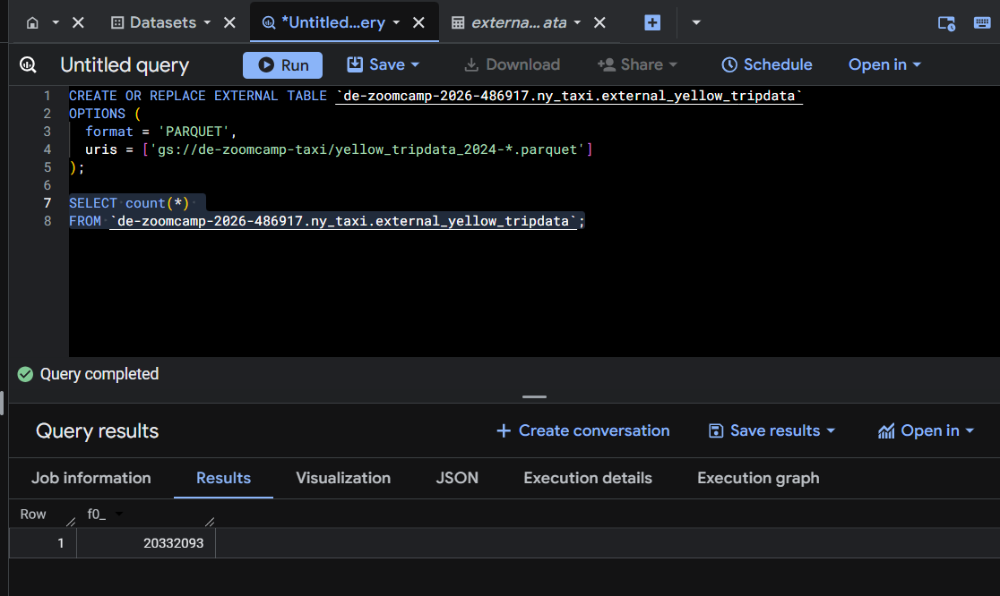
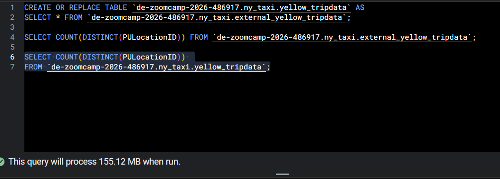
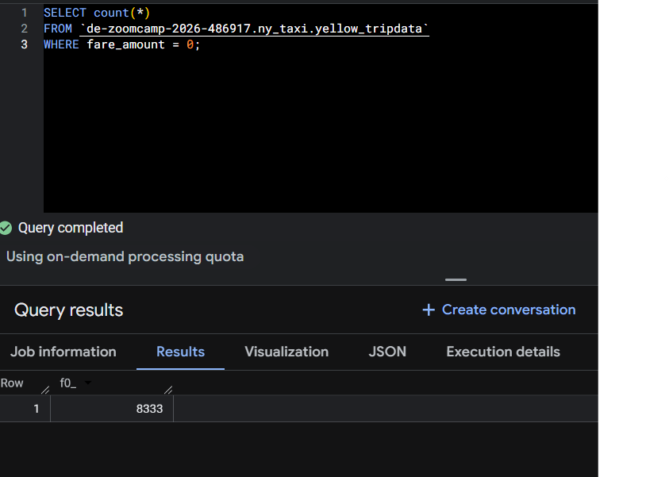
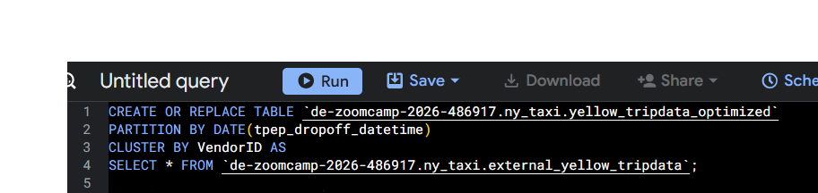
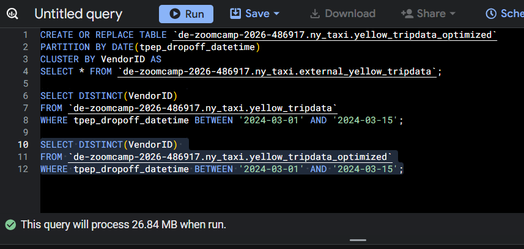

# Module 3 Homework: Data Warehousing & BigQuery

## Data

For this homework we will be using the Yellow Taxi Trip Records for January 2024 - June 2024 (not the entire year of data).

Parquet Files are available from the New York City Taxi Data found here:

https://www.nyc.gov/site/tlc/about/tlc-trip-record-data.page

## BigQuery Setup

Create an external table using the Yellow Taxi Trip Records. 

Create a (regular/materialized) table in BQ using the Yellow Taxi Trip Records (do not partition or cluster this table). 

## Question 1. Counting records

What is count of records for the 2024 Yellow Taxi Data?
- 65,623
- 840,402
- **20,332,093**  
- 85,431,289

**Answer:** **20,332,093**

## Question 2. Data read estimation

Write a query to count the distinct number of PULocationIDs for the entire dataset on both the tables.
 
What is the **estimated amount** of data that will be read when this query is executed on the External Table and the Table?

- 18.82 MB for the External Table and 47.60 MB for the Materialized Table
- **0 MB for the External Table and 155.12 MB for the Materialized Table**  
- 2.14 GB for the External Table and 0MB for the Materialized Table
- 0 MB for the External Table and 0MB for the Materialized Table

**Answer:**  
0 MB for the External Table and 155.12 MB for the Materialized Table

## Question 3. Understanding columnar storage

Write a query to retrieve the PULocationID from the table (not the external table) in BigQuery. Now write a query to retrieve the PULocationID and DOLocationID on the same table.

Why are the estimated number of Bytes different?
- **BigQuery is a columnar database, and it only scans the specific columns requested in the query. Querying two columns (PULocationID, DOLocationID) requires** 
reading more data than querying one column (PULocationID), leading to a higher estimated number of bytes processed.
- BigQuery duplicates data across multiple storage partitions, so selecting two columns instead of one requires scanning the table twice, 
doubling the estimated bytes processed.
- BigQuery automatically caches the first queried column, so adding a second column increases processing time but does not affect the estimated bytes scanned.
- When selecting multiple columns, BigQuery performs an implicit join operation between them, increasing the estimated bytes processed

**Answer:**  
BigQuery is a columnar database, and it only scans the specific columns requested in the query. Querying more columns results in more data being read.

## Question 4. Counting zero fare trips

How many records have a fare_amount of 0?
- 128,210
- 546,578
- 20,188,016
- **8,333**

**Answer:**  
8,333

## Question 5. Partitioning and clustering

What is the best strategy to make an optimized table in Big Query if your query will always filter based on tpep_dropoff_datetime and order the results by VendorID (Create a new table with this strategy)

- **Partition by tpep_dropoff_datetime and Cluster on VendorID**
- Cluster on by tpep_dropoff_datetime and Cluster on VendorID
- Cluster on tpep_dropoff_datetime Partition by VendorID
- Partition by tpep_dropoff_datetime and Partition by VendorID

**Answer:**  
Partition by `tpep_dropoff_datetime` and Cluster on `VendorID`

## Question 6. Partition benefits

Write a query to retrieve the distinct VendorIDs between tpep_dropoff_datetime
2024-03-01 and 2024-03-15 (inclusive)

Use the materialized table you created earlier in your from clause and note the estimated bytes. Now change the table in the from clause to the partitioned table you created for question 5 and note the estimated bytes processed. What are these values? 

Choose the answer which most closely matches.
 

- 12.47 MB for non-partitioned table and 326.42 MB for the partitioned table
- **310.24 MB for non-partitioned table and 26.84 MB for the partitioned table**
- 5.87 MB for non-partitioned table and 0 MB for the partitioned table
- 310.31 MB for non-partitioned table and 285.64 MB for the partitioned table

**Answer:**  
310.24 MB for non-partitioned table and 26.84 MB for the partitioned table

## Question 7. External table storage

Where is the data stored in the External Table you created?

- Big Query
- Container Registry
- **GCP Bucket**
- Big Table

**Answer:**  
GCP Bucket

An external table in BigQuery does not store data inside BigQuery itself. Instead, it references data that remains in external storage, such as files stored in a Google Cloud Storage (GCS) bucket.

## Question 8. Clustering best practices

It is best practice in Big Query to always cluster your data:
- True
- **False**  

**Answer:**  
False
 
Clustering is beneficial only when queries frequently filter or aggregate on specific columns. Clustering all tables unnecessarily can increase storage and maintenance costs without improving performance.

## Question 9. Understanding table scans

No Points: Write a `SELECT count(*)` query FROM the materialized table you created. How many bytes does it estimate will be read? Why?

**Answer:**  
0 B
 
BigQuery stores metadata about the total number of rows in a table. When executing a `SELECT count(*)` query without any filters, BigQuery can return the result using this metadata instead of scanning the actual table data, resulting in **0 bytes processed**.

